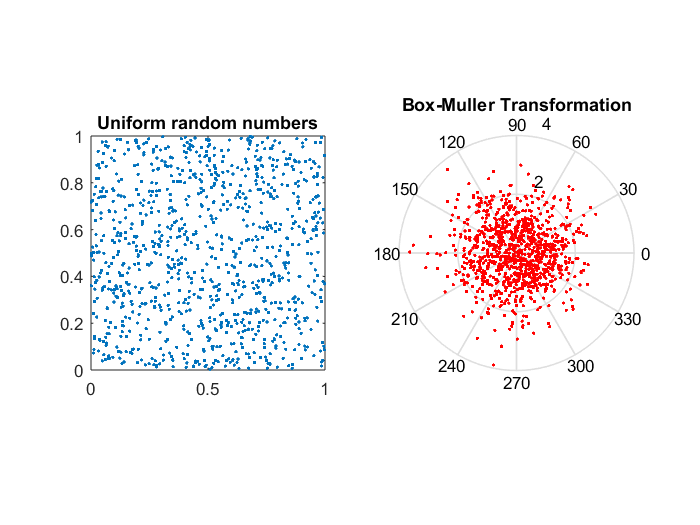

### Box-Muller generator

This project is an answer for following task:
>_"The company specializing in the mining industry deicided to invest in data analytical machines. There is no collected data, but company wants to have results of analysis ASAP. It is therefore necessary to generate random numbers which let us check if machines works correctly."_

In this project I created Box-Muller random number generator and I tested if it works correctly using:
* D'Agostino Pearson normality test,
* Kolmogorov-Smirnov normality test,
* Quantile charts.

_Code written in **Python**._   
  
  
**How Box-Muller generator works?**  
In simply words, it just takes two samples from the uniform distribution on the interval and maps them to two standard, normally distributed samples. The differences before and after Box-Muller transformation you can see below:

Wery interesting Box-Muller visualisation you can find [here](https://upload.wikimedia.org/wikipedia/commons/1/1f/Box-Muller_transform_visualisation.svg).  
More informations about Box-Muller transformation you can find [here](https://en.wikipedia.org/wiki/Box%E2%80%93Muller_transform). 
